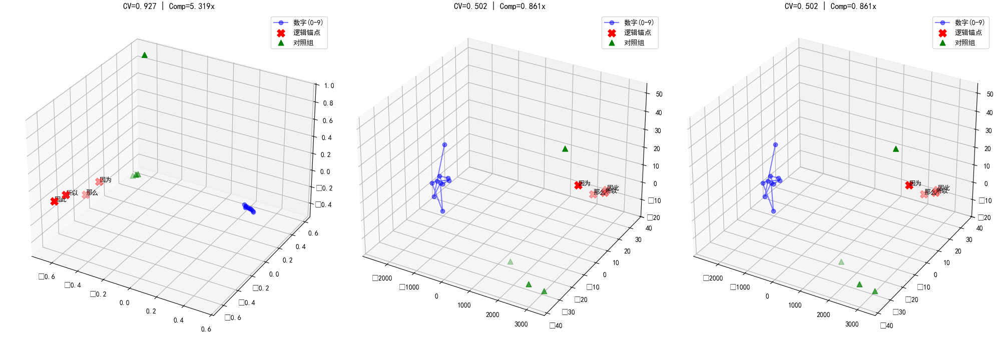

# geometric-identity-llm

[](https://www.python.org/)
[](LICENSE)


Wang, Z. (2026). Geometric Identity and Piecewise Constrained Manifolds: A Unified Framework for Logical Reasoning in Large Language Models. Zenodo. https://doi.org/10.5281/zenodo.18402828


本项目是一个基于 **向量几何理论 (Vector Geometry Theory, VGT)** 的实验工具包，旨在通过几何视角量化大语言模型（LLM）的逻辑推理能力。我们通过分析 `Qwen3-4B` 等模型的隐空间拓扑，验证了 **分段约束流形 (Piecewise Constrained Manifolds, PCM)** 与 **几何认同论 (Geometric Identity Theory, GIT)**
。



## 🧪 核心实验发现

基于本项目代码对 `Qwen3-4B` 层级特征的提取，我们验证了以下 VGT 核心发现：

1. [cite_start]**分段约束流形 (PCM) 的发现 [cite: 7, 49, 60]**：
   - [cite_start]在 Layer 0 中，数字 0-9 并非均匀分布，而是形成了一个 **1D 分段约束流形** [cite: 7, 50]。
   - [cite_start]**进位边界效应**：步长分布呈现显著的非单调性（$CV=0.664$），在数字 **4→5** 处观察到 **54.4% 的步长骤降**，这被确认为“进位边界触发器”的几何编码 [cite: 7, 52, 61]。

2. [cite_start]**逻辑连接词的几何归一化 [cite: 8, 53]**：
   - [cite_start]逻辑锚点（如“因为”、“所以”）在流形上表现出 **2.65倍的异常聚集** [cite: 8, 54]。
   - [cite_start]这种聚集证明了算术逻辑与因果推理在几何底层是统一的 [cite: 8]。

3. [cite_start]**几何认同论 (GIT) 的验证 [cite: 10, 63]**：
   - [cite_start]实验证实 Token 的身份完全由其在逻辑流形上的 **几何坐标** 决定 [cite: 10, 64]。
   - [cite_start]**算子镜像实验**：通过交换“+”与“-”的嵌入向量，模型行为发生完全反转（输入 `5+1` 输出 `4`），但规则一致性保持完美，证明语义仅是几何的附带现象 [cite: 9, 58, 64]。


## 🛠️ 功能特性

- **多层隐藏状态提取**：拦截并分析从 Embedding 层到深层（Layer 22/23）的 `hidden_states`。
- **几何量化指标**：自动计算步长分布、变异系数 (CV) 以及逻辑压缩比（Compression Ratio）。
- **VGT 结构判定**：基于流形坍缩理论，自动诊断模型是否具备可靠的外推（Extrapolation）潜质。

## 📊 实验数据对比 (Qwen3-4B)

| 观察维度 | Layer 0 (初始化层) | Layer 22/23 (逻辑合成层) | VGT 理论解释 |
| :--- | :--- | :--- | :--- |
| **步长 CV 值** | 0.6 - 0.9 | **2.6+ (本项目观测值)** | [cite_start]从 PCM 流形向高阶算法算子的相变 [cite: 7, 11] |
| **逻辑压缩比** | ~0.8 (语义分散) | **0.03x (极度坍缩)** | [cite_start]逻辑算子的强制坍缩与相位对齐 [cite: 11, 26] |
| **流形形态** | [cite_start]分段线性 PCM [cite: 60] | [cite_start]动态算法骨架 [cite: 17] | [cite_start]逻辑不是规模问题，而是几何简洁性 [cite: 29, 70] |

## 🚀 快速开始

```bash
# 安装依赖
pip install torch transformers scikit-learn matplotlib

# 运行 VGT 几何探测脚本
python VGT_DeepLogic_Manifold.py
```
